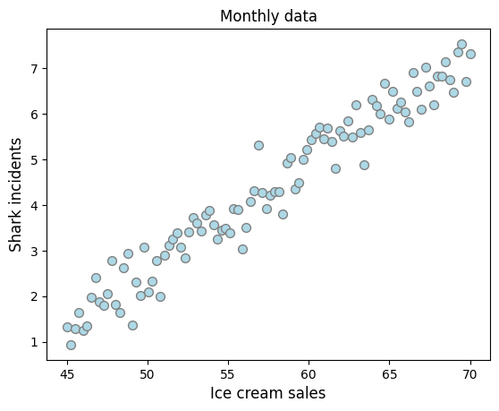
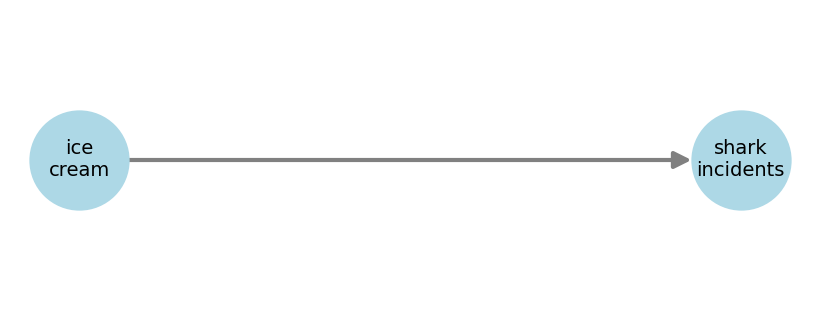

# **Confounders**
---

> TL;DR
> 
> A confounder is a variable that is not the treatment, nor the effect, but that can affect the association between the two.

---

You have some data on the monthly ice cream sales in Brazil and the number of shark attacks on a costal region. Both variables are highly correlated as shown below.

---

> TL;DR
> 
> The three elemental confounds are: the fork, the pipe, and the collider.

---

Add DAGs for them, explain each.