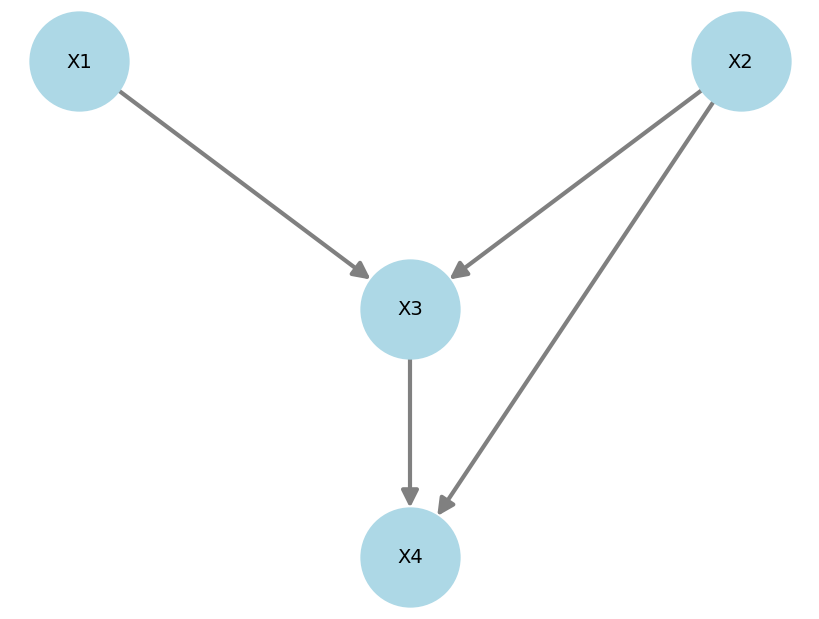

# **DAGs**
---

> TL;DR
> 
> DAGs are visual ways of expressing connections between variables.
---

Directed acyclic graphs (DAGs) are an easy way of expressing your beliefs about a set of variables. A DAG has one node per variable and a set of edges connecting the nodes. Also, edges must be directed and, by going around the graph following them, you should not be able to find any loops. 

Below is a nice DAG that makes intuitive sense.

Given a node (say *weigth*), a **parent** is a node that directly maps to it (*diet* and *exercise*).

Given a node (say *weigth*), a **child** is a node that is directly mapped by it (*blood pressure*).

---

> TL;DR
> 
> DAGs do not encode plain statistical independence, but conditional independence.
---

Take the following DAG:

It **does not imply/encode that $X1$ and $X4$ are independent**. It instead encodes the fact that, given all its parents ($X3$ and $X1$), the node $X4$ becomes independent of every one else ($X2$).

Thinking back at the blood pressure example, the graph says blood pressure is indeed dependent on the diet even if diet is not its parent. However, if one fixes a given weight and exercise level, then the diet would have *no influence* on an individual's blood pressure!

---

> TL;DR
> 
> Data alone (without any expert knowledge) is insufficient to arrive at a single DAG.
---

---

> TL;DR
> 
> DAGs tell you that two variables are linked, but won't tell you exactly how.

---

---

> TL;DR
> 
> An SCM is a DAG and a set of equations telling you exactly how variables are linked.

---

