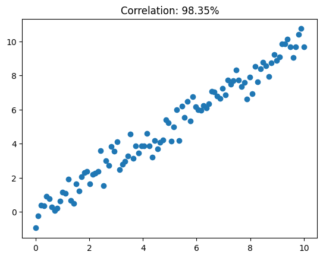
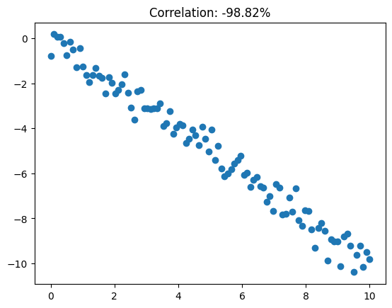
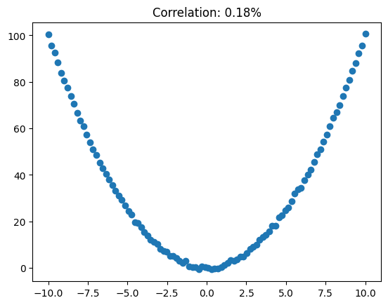

# **Association vs causation**
---

> TL;DR
> 
> Statistical association (including correlation) does not imply causation. That's because correlation can be induced by other phenomena apart from causation.

---

Say $X1$ is the annual chocolate consumption (in kg/capita) of a country. $X2$ is the number of Nobel Prize Laureates (per 10^7 inhabitants). If you compute the correlation between $X1$ and $X2$ you could arrive at numbers as high as $R=0.69$ and p-values as low as $p=0.0004$.

This suggests a strong (and statistically significant) association between chocolate consumption and cognitive function enhancement.

Although it's amusing to think chocolate will help you get that smarter, it's also hard to believe that is indeed the case. If you think about it harder though, which of the following conclusions should one draw from such association?

1. Chocolate makes you smarter, leading to a higher count of nobel prizes.
2. People like to celebrate the winnin of a nobel prize by eating loads of chocolate.
3. Maybe the two above are true.
4. In wealthy countries people tend to eat more chocolate. Also, they tend to have better education, leading to more nobel prizes.
5. Something else entirely...

Even though, mathematically, we can show $X1$ and $X2$ are strongly associated, increasing/activating/enabling/making use of $X1$ won't guarantee the effect $X2$. 

---

> TL;DR
> 
> Causation is 

---

---

> TL;DR
> 
> Correlation is a very narrow measure of association.

---

Look at the examples below and at how correlated variables $X$ and $Y$ are.

Pearson's correlation (a.k.a. correlation) can capture linear relationships in the upward and downward directions, but fail to capture other functional links (e.g. the quadratic form).

A plethora of other association measures exist. Some handle continuous variables, others handle categorical variables. Each of them will assess one specific type of link between the random variables at hand.

See: [this wikipedia section](https://en.wikipedia.org/wiki/Correlation#Other_measures_of_dependence_among_random_variables) on other measures of dependence.