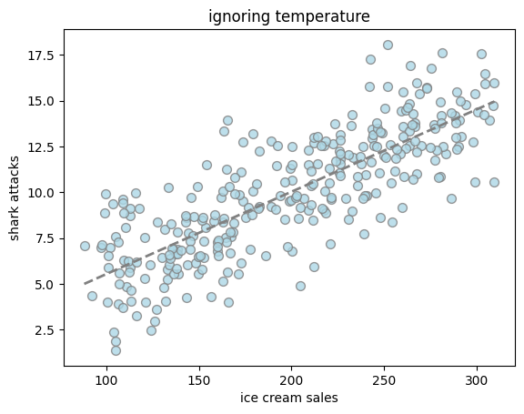
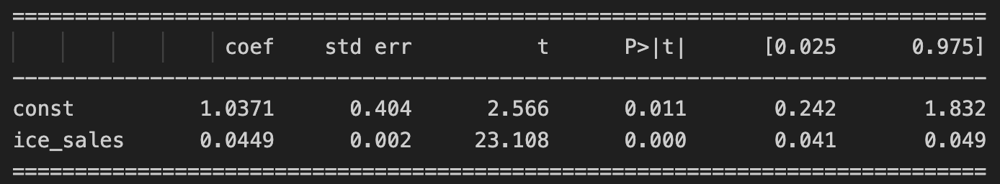
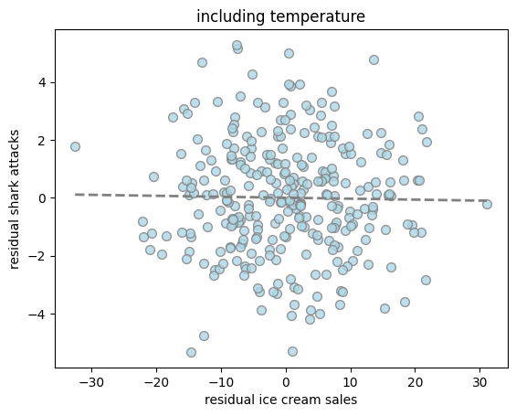
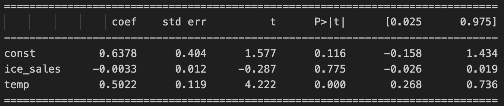

# **Confounders**

!!! tip "TL;DR"
    A confounder is a variable that is not the treatment, nor the effect, but that can affect the association between the two.

You have some data on the monthly ice cream sales in Brazil and the number of shark attacks on a costal region. Both variables are highly correlated as shown below.

  

One could propose the following DAG to try to explain the phenomenon.

  

But perhaps the one below, with season influencing both blue variables, would be a more sensible structure.

  

**The season node is a confounder** as it affects both main variables of interest. In this example, it being summer drives up both ice cream sales and shark incident, giving the impression there is a causal link between the two.

!!! tip "TL;DR"
    Confounders are bad: they can lead you to spurious conclusions if you ignore them. 

If you fit a linear model to predict shark attacks from ice cream sales, you get a very nice graph (see [notebook](https://github.com/emilioMaddalena/causal-inference-studies/blob/main/notebooks/sharks_and_ice_creams.ipynb))

  

Not only that, the linear coefficient of the predictor (ice cream sales) even has a very low p-value

  

So it's all statistically sound, right? So if we stop selling ice cream, surely we'll also save some swimmers lives...

---

Well, if you had included temperature, you'd see a very different picture

  

And the p-values of ice cream are now very high

  

From our knowledge of how the world works, this second model seems more reasonable than the first one. 

Causal inference is all about **making use of that expert knowledge as the first steps of the process**, before estimating any linear/non-linear relationships. In that way, we can better trust the outcomes of our models.

!!! tip "TL;DR"
    :sparkles::sparkles::sparkles: Treatment randomization is magical: it makes all confounding go away! :sparkles::sparkles::sparkles: 

If you were to randomly give out ice cream to people, regardless of the season, you would see the association between ice cream and shark attacks disappear.

With the DAG in mind, randomization would **cut the arrow** that connects season and ice cream, disqualifying season as a confounder.

This is the beauty of randomized controlled trials (RCTs), widely employed in medical studies. By randomly assigning patients to the treatment or control group, you break all confounding. No wonder why RCTs are regarded as a gold standard in that field.

!!! tip "TL;DR"
    Under no confounding, causal inference becomes trivial.

Say you want to estimate the average extra hours of sleep you get if you take some miraculous new medicine

$$\text{ATE} = E[Y(1) - Y(0)]$$

You run an experiment and, if $T$ was randomized, the causal effect is as simple as

$$\text{ATE} = E[Y \, | \, T=1] - E[Y \, | \, T=0]$$

that is, averaging the sleep hours $Y$ among all people who got the med, and subtracting the average sleep hours $Y$ for all who didn't take the med.

N.B. Of course you'd still have to check if the final number is reliable or not (was your sample too small?). The estimator isn't biased, but variance can still hit you hard. 

!!! tip "TL;DR"
    When you can't run experiments, you need causal inference tools. :wrench::hammer:

Experiments are great! but sometimes you can't run them for a variety of reasons: costs, regulatory restrictions[^1], ethical implications[^2], and practical infeasibility[^3].

Say you're given **observational data**: some treatment/policy/intervention data points where the units have some features, and you also see some additional covariates, and all those variables interact in certain ways. Then your best bet is to carefully draw a DAG and apply causal inference techniques if you want to draw causal conclusions from the dataset.

This will ensure your model generalizes way better! :sunglasses:

[^1]: You're legally not allowed to manipulate markets in certain ways.

[^2]: You can't expose people to health hazards, e.g. asking some group to smoke.

[^3]: The treatment is having grey-colored eyes, and the control is having any other eye color...