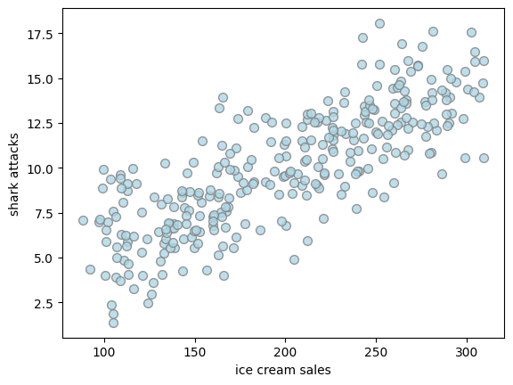
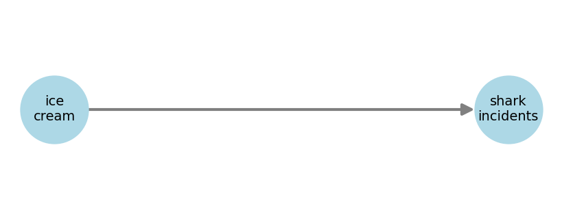
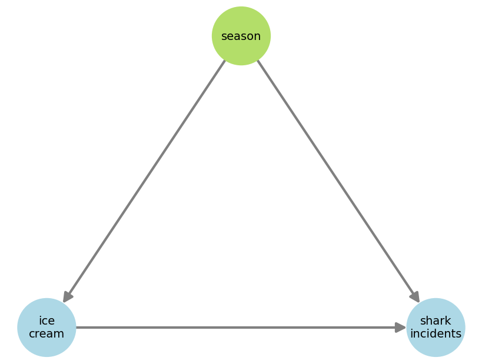
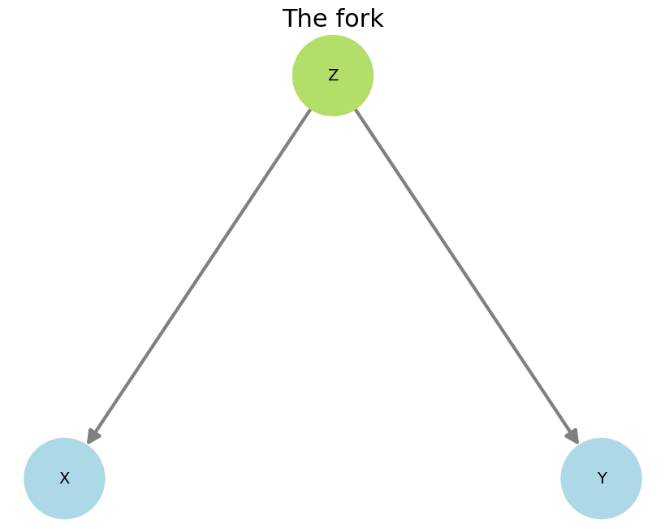
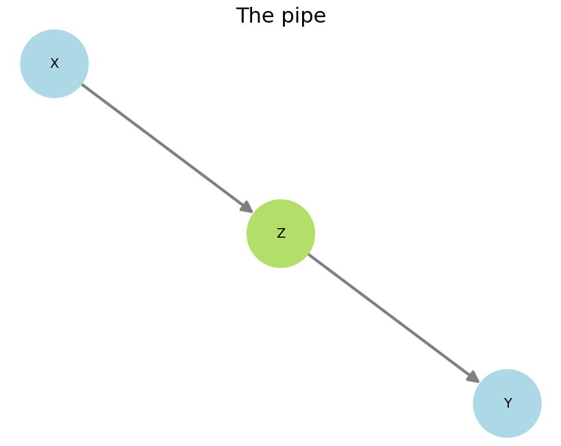
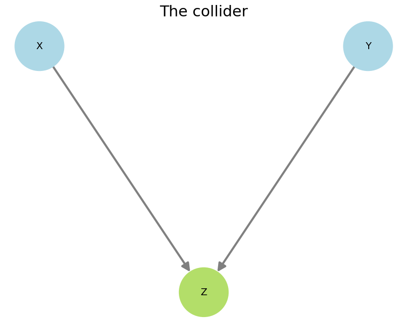

# **Confounders**

!!! tip "TL;DR"
    A confounder is a variable that is not the treatment, nor the effect, but that can affect the association between the two.

You have some data on the monthly ice cream sales in Brazil and the number of shark attacks on a costal region. Both variables are highly correlated as shown below.

One could propose the following DAG to try to explain the phenomenon.

But perhaps the one below, with season influencing both blue variables, would be a more sensible structure.

**The season node is a confounder** as it affects both main variables of interest. In this example, it being summer drives up both ice cream sales and shark incident, giving the impression there is a causal link between the two.

!!! tip "TL;DR"
    The three elemental confounds are: the <strong>fork</strong>, the <strong>pipe</strong>, and the <strong>collider</strong>.

There are three main types of confounding structures, which are defined by 3-node diagrams. Any more complex DAG can be analyzed based on these.

  
  
  

At first sight, the collider seems inoffensive as there are no arrows going from $Z$ to $X$ or $Y$, so how could it bias our analysis?

Well, causal effects respect the arrow directions, but statistical association doesn't. It can flow against them.

!!! tip "TL;DR"
    :sparkles::sparkles::sparkles: Treatment randomization is magical: it makes all confounding go away! :sparkles::sparkles::sparkles: 

If you were to randomly give out ice cream to people, regardless of the season, you would see the association between ice cream and shark attacks disappear.

With the DAG in mind, randomization would **cut the arrow** that connects season and ice cream, disqualifying season as a confounder.

This is the beauty of randomized controlled trials (RCTs), widely employed in medical studies. By randomly assigning patients to the treatment or control group, you break all confounding. No wonder why RCTs are regarded as a gold standard in that field.

