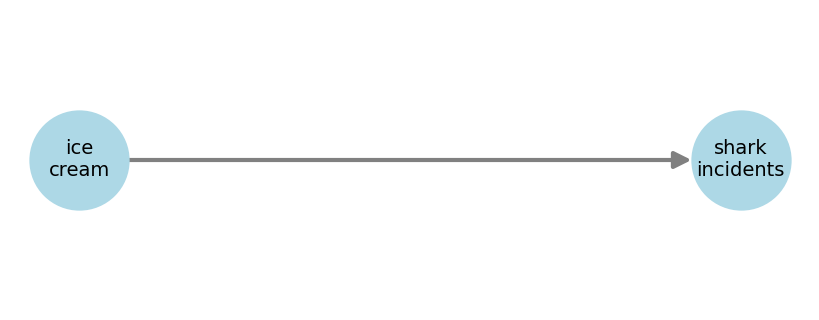

# **Confounders cont'd**
---

> TL;DR
> 
> d-separation.

---

You have some data on the monthly ice cream sales in Brazil and the number of shark attacks on a costal region. Both variables are highly correlated as shown below.

One could propose the following DAG to try to explain the phenomenon.

But perhaps the one below, with season influencing both blue variables, would be a more sensible structure.

**The season node is a confounder** as it affects both main variables of interest. In this example, it being summer drives up both ice cream sales and shark incident, giving the impression there is a causal link between the two.

---

> TL;DR
> 
> The three elemental confounds are: the fork, the pipe, and the collider.

---

There are three main types of confounding structures, which are defined by 3-node diagrams. Any more complex DAG can be analyzed based on these.

At first sight, the collider seems inoffensive as there are no arrows going from $Z$ to $X$ or $Y$, so how could it bias our analysis?

Well, causal effects respect the arrow directions, but statistical association doesn't. It can flow against them.