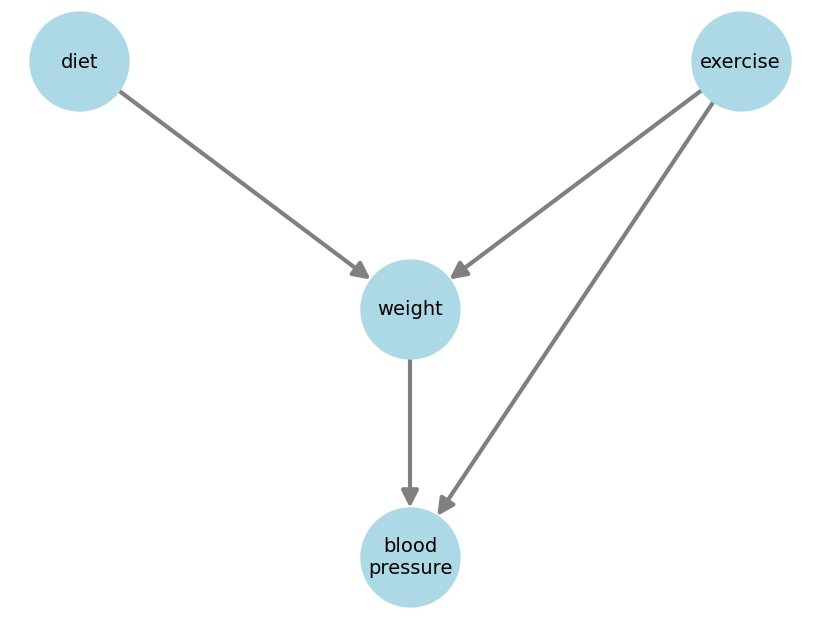
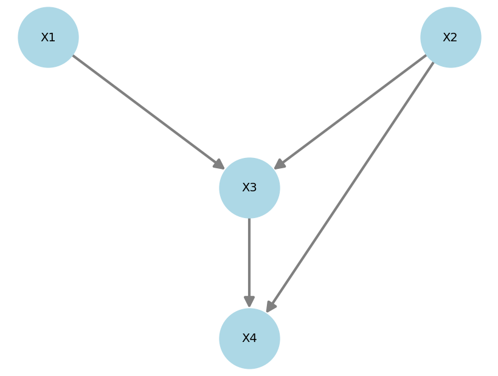
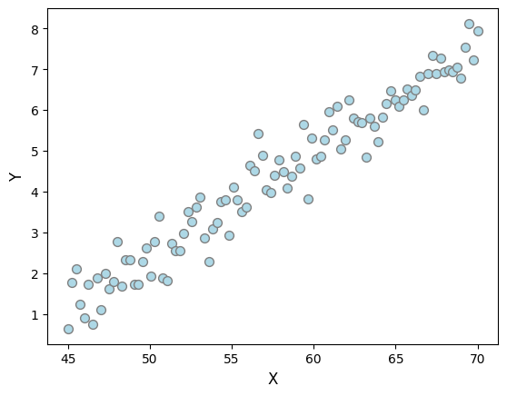

# **DAGs**

!!! tip "TL;DR"
    DAGs are visual ways of expressing connections between variables.

Directed acyclic graphs (DAGs) are an easy way of expressing your beliefs about a set of variables. 

A DAG has one node per variable and a set of edges connecting the nodes. Also, edges must be directed and, by going around the graph following them, you should not be able to find any loops. 

Below is a nice DAG that makes intuitive sense.

Given a node (say *weight*), a **parent** is a node that directly maps to it (*diet* and *exercise*).

Given a node (say *weight*), a **child** is a node that is directly mapped by it (*blood pressure*).

!!! tip "TL;DR"
    DAGs do not encode plain statistical independence, but conditional independence.

Take the following DAG:

It **does not imply/encode that $X1$ and $X4$ are independent**. It instead encodes the fact that, given all its parents ($X3$ and $X2$), the node $X4$ becomes independent of every one else ($X1$).

Mathematically, $X1 \perp X4 \; | \; (X3, X2)$.

Thinking back at the blood pressure example, the graph says blood pressure is indeed dependent on the diet even if diet is not its parent. However, if one fixes a given weight and exercise level, then the diet would have *no influence* on an individual's blood pressure!

!!! tip "TL;DR"
    Data alone (without any expert knowledge) is insufficient to arrive at a single DAG.

Say you're given the data below, which clearly show $X1$ and $X2$ are strongly associated. Which DAG would represent it best?

$X \rightarrow Y$ would be a reasonable first try... but if I told you $X$ is body weight and $Y$ is monthly chocolate consumption, then perhaps $Y \rightarrow X$?

Only because the plot shows $X$ on the horizontal axis, it doesn't mean it is the cause of $Y$ like we're used to thinking...

What if a nutritionist comes and says a third variable is missing, $Z$, which represent one's metabolism. And that a better DAG would be $Y \rightarrow Z \rightarrow X$?

If even in the 2-variable case we require more assumptions to draw a sensible DAG, imagine how difficult the task would be with 20 interconnected variables. The process of finding DAGs from data and additional assumptions is called causal discovery.

!!! tip "TL;DR"
    A DAG highlights links, but an SCM tells you *exactly* how variables are linked, functionally.

DAGs tell you that two variables are linked, but won't tell you exactly how. A **structural causal model** (SCM), on the other hand, does exactly that.

Say you have a set of variables $X_1,...,X_4$. A SCM is a collection of equations linking them:

$$\begin{align}
X_1 &= f_1(N_1) \nonumber \\
X_2 &= f_2(N_2) \nonumber \\
X_3 &= f_3(X_1, X_2, N_3) \nonumber \\
X_4 &= f_4(X_2, X_3, N_4) \nonumber
\end{align}$$

where $N_1,...,N_4$ are exogenous variables, also called noise variables. Noise variables are assumed to be jointly independent.

!!! tip "TL;DR"
    Association can flow against arrows, causality cannot.

