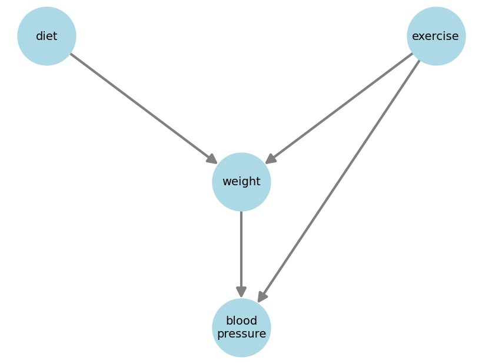
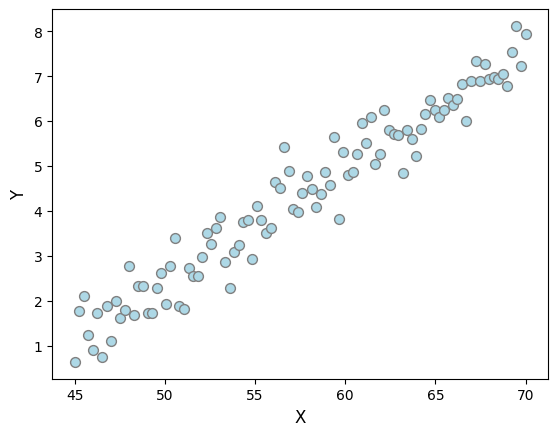

# **DAGs**

!!! tip "TL;DR"
    DAGs are visual ways of expressing connections between variables.

Directed acyclic graphs (DAGs) are an intuitive way of expressing your beliefs about a set of variables. 

A DAG has one node per variable and a set of edges connecting the nodes. Also, edges must be directed and, by going around the graph following them, you should not be able to find any loops. 

Take a look at this one DAG and see if you agree with it

  

According to it, exercise influences blood pressure directly, maybe because it increases your bpm right away. But it also influences blood pressure indirectly, by reducing your weight, thus reducing your blood pressure.

!!! example "Here's some terminology"
    - Given a node (say *weight*), a **parent** is a node that directly maps to it (*diet* and *exercise*).
    - Given a node (say *weight*), a **child** is a node that is directly mapped by it (*blood pressure*).
    - A **root node** is a node with no parents (*diet* and *exercise*).
    - A **leaf node** is a node with no children (*blood pressure*).
    - A **directed path** is a path across nodes that doesn't go against any arrows (e.g. *exercise* -> *weight* -> *blood pressure*)
    - A node (say *blood pressure*) is a **descendant** of another node (*diet*) if there's a directed path linking the latter to the former.
    - Check [this wikipedia page](https://en.wikipedia.org/wiki/Glossary_of_graph_theory) for a comprehensive glossary!

!!! tip "TL;DR"
    DAGs do not encode plain statistical independence, but conditional independence.

Take the following DAG

  

**It does not imply/encode that $X1$ and $X4$ are independent**. It instead encodes the fact that, given all its parents ($X3$ and $X2$), the node $X4$ becomes independent of every one else ($X1$).

Mathematically, $X1 \perp X4 \; | \; (X3, X2)$. Or, more generally,

$$X_i \perp \text{NonDesc}(X_i) \; | \; \text{Pa}(X_i)$$

where $\text{NonDesc}(X_i)$ are all non-descendants of $X_i$. This is called the **local Markov property**.

This leads to the following factorization formula for DAGs

$$P(X_1, X_2, \dots, X_n) = \prod_{i=1}^{n} P(X_i \; | \; \text{Pa}(X_i))$$

which is known as the **Markov factorization of DAGs**.

!!! tip "TL;DR"
    Data alone (without any expert knowledge) is insufficient to arrive at a single DAG.

Say you're given the data below, which clearly show $X1$ and $X2$ are strongly associated. Which DAG would represent it best?

  

$X \rightarrow Y$ would be a reasonable first try... but if I told you $X$ is body weight and $Y$ is monthly chocolate consumption, then perhaps $Y \rightarrow X$?

Only because the plot shows $X$ on the horizontal axis, it doesn't mean it is the cause of $Y$ like we're used to thinking...

What if a nutritionist comes and says a third variable is missing, $Z$, which represent one's metabolism. And that a better DAG would be $Y \rightarrow Z \rightarrow X$?

If even in the 2-variable case we require more assumptions to draw a sensible DAG, imagine how difficult the task would be with 20 interconnected variables. The process of finding DAGs from data and additional assumptions is called causal discovery.

!!! tip "TL;DR"
    DAGs define dependencies, but won't tell you exactly *how* those variables are linked... SCMs give you that last part of the puzzle.

Say you have a set of variables $X_1,...,X_4$. A structural causal model (SCM) is a collection of equations linking them:

$$\begin{align}
X_1 &= f_1(N_1) \nonumber \\
X_2 &= f_2(N_2) \nonumber \\
X_3 &= f_3(X_1, X_2, N_3) \nonumber \\
X_4 &= f_4(X_2, X_3, N_4) \nonumber
\end{align}$$

where $N_1,...,N_4$ are exogenous variables, also called noise variables. Noise variables are assumed to be jointly independent.

At first sight, you could think the $N_i$ components are there just to account for *random fluctuations* of the $X_i$ such as noise in your measurement instrument. In practice, though, they're there also to capture **the influence of all variables that you didn't include in your DAG**.

Think of all the possible factors that influence someone's blood pressure. Could you list them all? Can you measure them all? Probably not. 

So long as the un-measures variables don't interact with each other (that is, the $N_i$s are jointly independent) CI tools will work just fine!

!!! tip "TL;DR"
    Association can flow against arrows, causality cannot.

