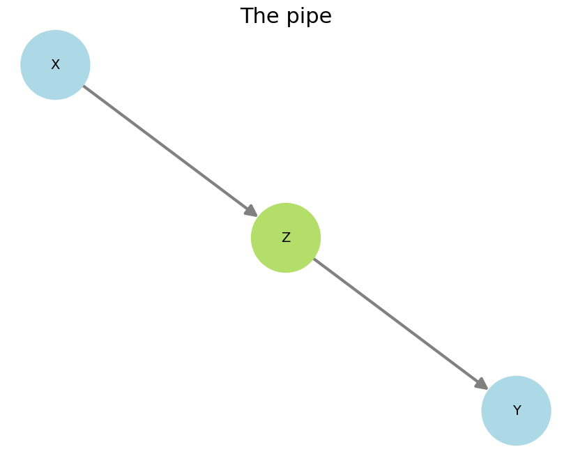

# **DAGs 2**

!!! tip "TL;DR"
    The <strong>fork</strong>, the <strong>pipe</strong>, and the <strong>collider</strong> are three elemental building blocks of any DAG.

These are important basic structures that can be used to analyze more complex DAGs.

  
  
  

Because those variables are all linked, **statistical association can in principle be found between any pair of variables**. That's what causes you to see links between quantities you'd otherwise think are completely (causally) unrelated. 

But worry not! It turns out we can stop spurious associations from contaminating our estimates. We do that simply by conditioning on (aka controlling for) the right variables, which causes variables that are not causally linked to not display associations anymore. In the CI jargon, that's referred to as **blocking paths**.

!!! tip "TL;DR"
    In a fork, conditioning on $Z$ blocks the path between $X$ and $Y$.

From the Markov factorization of the fork, we have

$$p(X,Y,Z) = p(X|Z) \; p(Z) \; p(Y|Z)$$

Now the conditional $p(X,Y | Z)$ can be written as[^1]

$$
\begin{align}
p(X,Y | Z) &= \frac{p(X,Y,Z)}{p(Z)} \\[5pt]
&= p(X|Z) \; p(Y|Z)
\end{align}
$$

which is the definition of the conditional independence $X \perp Y  \, | \, Z$.

!!! tip "TL;DR"
    In a pipe, conditioning on $Z$ blocks the path between $X$ and $Y$.

This will be similar to the fork case. We have

$$p(X,Y,Z) = p(X) \; p(Z|X) \; p(Y|Z)$$

Then[^2]

$$
\begin{align}
p(X,Y | Z) &= \frac{p(X,Y,Z)}{p(Z)} \\[5pt]
&= \frac{p(X) \; p(Z|X) \; p(Y|Z)}{p(Z)} \\[5pt]
&= \frac{p(X,Z) \; p(Y|Z)}{p(Z)} \\[5pt]
&= p(X|Z) \; p(Y|Z)
\end{align}
$$

which is the definition of the conditional independence $X \perp Y  \, | \, Z$.

!!! tip "TL;DR"
    In a collider, the path between $X$ and $Y$ **is naturally closed**.

From the Markov factorization of the fork, we have

$$p(X,Y,Z) = p(X) \; p(Y) \; p(Z|X,Y)$$

then

$$
\begin{align}
p(Y|X) &= \frac{p(X,Y)}{p(X)} \\[5pt]
&= \frac{\sum_z p(X,Y,Z)}{p(X)} \\[5pt]
&= \frac{\sum_z p(X) \; p(Y) \; p(Z|X,Y)}{p(X)} \\[5pt]
&= \frac{p(X) \, p(Y)}{p(X)} \\[5pt]
&= p(Y)
\end{align}
$$

So $p(X,Y) = p(X) \, p(Y|X) = p(X) p (Y)$, which is the definition of the independence $X \perp Y$.

!!! abstract "Final remarks"

    At this point we know that paths can be opened and closed, so...

    - Which paths should we open and which should we close?
    - How can this be generalized to more complex graphs?
    - What if I need to condition on a variable I actually didn't measure?

    Basically, we first need to define what exactly it is we want to measure. Maybe the "direct" influence of $X$ on $Y$, or the "total" influence perhaps? Different causal effect are discussed [here](causal_effects.md).

    Next we need to understand what roles the other variables in the DAG play in this analysis, and block any potentially unwanted association. Confounders, i.e. variables that could corrupt our analysis, are tackled [here](confounders.md). A general criterion for deciding what to block and what not to block is given [here](feature_selection_2.md).

[^1]: The first equality follows from the def. of the conditional probability. The second, from the Markov factorization above.
[^2]: The first equality follows from the def. of the conditional probability. The second, from the Markov factorization above. The third, from the product rule. The fourth, from the definition of the conditional probability.
