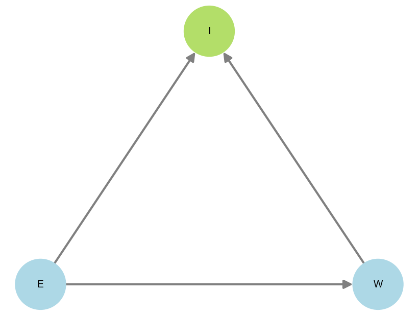
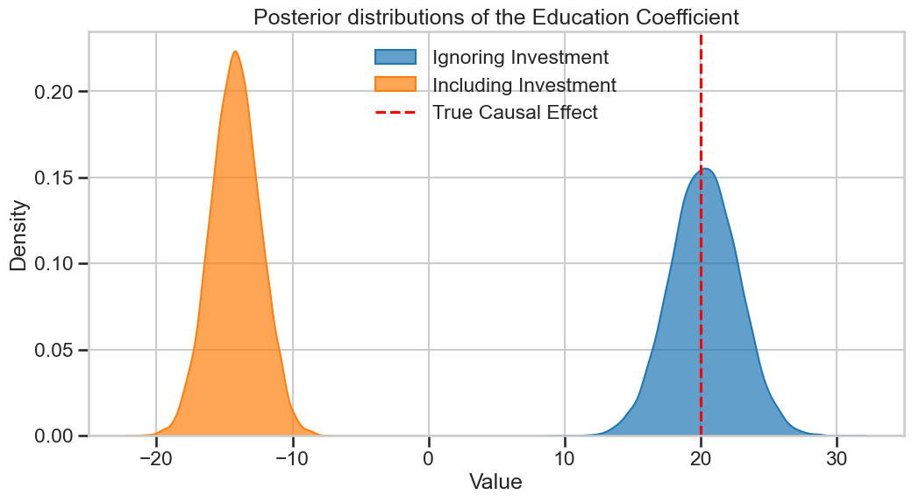

# **Feature selection**

!!! tip "TL;DR"
    All confounders must be controlled for, that is, included in your model as features.

Failing to do that will lead to biased estimates, for instance concluding that [ice cream sales are linked to shark attacks](confounders.md/#TLDR-confounders-are-bad).

!!! tip "TL;DR"
    How about including all you have? Well, it turns out that's also a bad idea sometimes...

When you have *a collider* between treatment and outcome for example, that variable is best left alone. 

In [this notebook](../notebooks/education_wage_investments.ipynb), we explore how education (E) could affect wages (W). It turns out we also have access to how much money our subjects invest (I), and decided to add that to our model since it could provide some extra insights, right? :thinking_face:

Well, here's the DAG we have at hand

  

Education influences wage levels, and more educated people also tend to invest more. Also, people with higher income also tend to invest more. 

In our simulations, we set the real factor linking education to wages to be $20$, which where we are at if we only use $E$ to predict $I$ (blue distribution). However, look at what happens when we add the I variable (orange distribution)

  

Not only is it biased, but it's turned negative! Such an analysis would conclude that the more you study, the lower your chances of earning more.

!!! tip "TL;DR"
    Some variables are neutral, including them or not doesn't make a difference.

!!! tip "TL;DR"
    The backdoor criterion tells us which variables to include in our models.

!!! tip "TL;DR"
    All adjustment sets are equal, but some are more equal than others.

!!! tip "TL;DR"
    To estimate causal effects well, you need to carefully select your features/predictors/regressors.

Modern machine learning advocates for including all you can in your model, trying to achieve the lowest possible (test) error.

This is a fair strategy if you are aiming at **capturing patterns and predicting labels**. 

If, however, your goals are more causal oriented (see the [causal questions page](causal_questions.md)), for instance:

- Study *the main drivers* of your output variable
- *Design a policy* based on your model to influence your output
- Understand *what would have been* if one of your variables had taken a different value

then the ML approach can fall short of delivering a good answer. 

