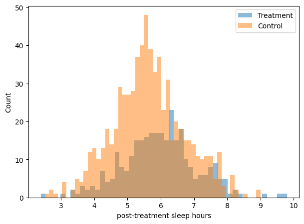

# **Observational data: how confounded?**

!!! tip "TL;DR"
    Observational data is data that wasn't collected via a randomized procedure. As a result, the treatment and control groups will display differences that can confound your analysis.

In many real-world business/medical/social contexts, randomly assigning participants to the treatment and control groups is not possible for economical and/or ethical reasons. 

Picture a group of medical doctors studying the effects of consuming illegal drug X daily. Imagine an e-commerce platform wanting to know the effects giving out a 20% discount voucher has on loyal customers. Consider a social scientist comparing single-sex vs mixed-sex education systems. In none of those cases will randomized data be easy to get!

As a result, many datasets are observational... 

Are all observational datasets created the same, though? or are some more confounded than others?

!!! example "Example"
    Consider the same sleeping pill medical study setting we had in the [randomized data page](randomized_data_why_and_how.md).

    However, this time around the data you have looks like this: $694$ in the control group and $306$ in the treatment group... Not only are they imbalanced in count, but their `baseline_sleep` and `age` distributions don't look very similar either.

    

      
    

    Looking at the outcome variable `post-treatment sleep hours`, the orange and blue plots overlap a lot and it isn't clear what the effect of taking the sleeping pill was.

    

      
    

    If you naively compute the difference in means, and maybe throw in some bootstrapping at it too, you'd get an "ATE" of $\tau = 0.34$ hours with a 95%-CI of $[0.187, 0.483]$.

    That's terrible as the true ATE used to generate the data was $0.85$! 😦

Let $X_0$ and $X_1$ denote respectively the control and treatment groups. To measure the discrepancy between datasets and detect data imbalance, we have many tools at hand, and they all complement each other. 

### 0 - Per feature Mean Difference 

This might be your first go-to metric, and people can easily relate to as the resulting unit is the same as the feature itself.

$$\text{MD} = \bar X_1 - \bar X_0$$

In the example above, we have $\text{MD}_{\text{age}} = 54.6 - 47.0 = 7.6$ years and $\text{MD}_{\text{baseline sleep}} = 5.5 - 6.6 = -1.1$ hours.

### 1 - Per feature Standardized Mean Difference

Is an $\text{MD}$ of $7.6$ years too high? Well, the number alone doesn't tell us much if you don't take any measure of spread from the sample set into account. That's exactly what the Standardized Mean Difference does.

$$\text{SMD} = \frac{\bar X_1 - \bar X_0}{\sqrt{(s_1^2 - s_0^2) / 2}}$$

Typically, $|\text{SMD}| < 0.1$ is considered a negligible imbalance, and $|\text{SMD}| < 0.2$ points to a serious imbalance. Anything in between is up for you to decide. In our example we have $\text{SMD}_{\text{age}} = 0.69$ and $\text{SMD}_{\text{baseline sleep}} = -1.18$.

### 2 - Per feature KS distance

The [Kolmogorov–Smirnov test](https://en.wikipedia.org/wiki/Kolmogorov%E2%80%93Smirnov_test) measures the maximum distance between two empirical cumulative distributions. Intuitively, it is the largest vertical gap the two cumulative distributions present. As opposed to the $\text{MD}$ and $\text{SMD}$, it can spot mismatches beyond the mean so it is more flexible in that sense.

$$\text{KS} = \sup_x |F_1(x) - F_0(x)|$$

If you use `scipy.stats.ks_2samp` to compute the metric for the data above, you'd get $\text{KS}_{\text{age}} = 0.32$ and $\text{KS}_{\text{baseline sleep}} = 0.49$.

    

