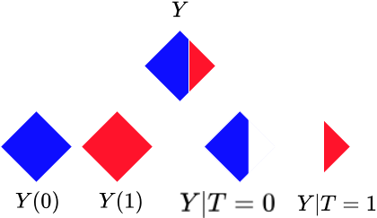

The potential outcomes (PO) model (aka Rubin Causal Model) was proposed by [Donald Rubin](https://en.wikipedia.org/wiki/Donald_Rubin), a famous psychologist/statistician.

There is a group of people sitting at a crossroads point, a bifurcation. What happens to them is captured by the $Y_i$ variables. Each person could either take the left path ($T=0$) or go right ($T=1$), and that'd lead them to the futures $Y_i(0)$ or $Y_i(1)$. 

- Person $7$ goes left and you measure their outcome $Y_7 = Y_7(0)$
- But what would have happened if they had gone right? 
- Sadly, you will never ever *measure* both $Y_7(0)$ and $Y_7(1)$[^1]...
- Can you say something about $Y(1)$ maybe, i.e. what happens across individuals if they take the left path?
- Maybe if enough data is captured, you could estimate $E[Y(0)]$?
- On average, is it better to go left or right?
- Can you put a number to $E[Y(0) - Y(1)]$?

!!! tip "TL;DR"
    The PO approach is all about measuring **what happened** $Y$, but also **what could have been** $Y(0)$ and $Y(1)$.

Of course, for every individual $Y_i$ will either match $Y_i(0)$ or $Y_i(1)$, but you'll never have the complete picture. One of the two outcomes will be missing. We refer to the missing one as the *counterfactual* outcome.

One key concept to understand is the difference between analyzing a potential outcome $Y(1)$ and conditioning on a treatment $Y|T=1$. The difference is illustrated by the diagram below

  

Conditioning $Y|T=1$ limits your sample to those points where the units were "treated" as desired. On the other hand, **the quantity $Y(1)$ is a thought experiment **where all units received the desired treatment. 

Because your dataset $Y$ contains some parts of the puzzle, under the right supporting assumptions, you can estimate lots of interesting quantities.

[^1]: That's called *the fundamental problem of causal inference*.