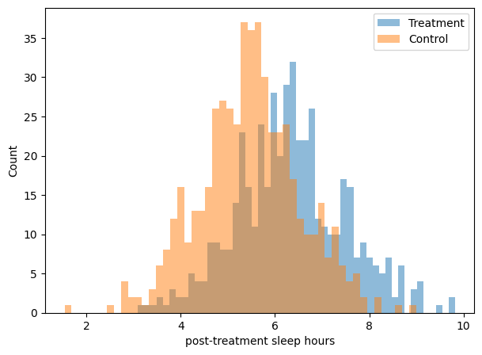

# **Randomized data**

!!! tip "TL;DR"
    Randomized data is gold. When you have it, estimating ATEs amounts to a difference in means.

When we say "randomized", we mean our dataset is free of bias. 

Mathematically, using the [Potential Outcomes](potential_outcomes.md) formalism, we require $Y(0), Y(1) \perp T$, which is known as the *Ignorability* or *Exchangeability* assumption. Essentially, you can ignore how units ended up in the treatment or control groups, because *the assignment was random*. Put otherwise, your results would have been the same (statistically), had you swapped units. 

Why is that so important, you ask? Well, because under that assumption 

$$
\begin{align}
E[Y(1) - Y(0)] &= E[Y(1)] - E[Y(0)] \\[5pt]
&= E[Y(1) | T=1] - E[Y(0) | T=0] \\[5pt]
&= E[Y | T=1] - E[Y | T=0]
\end{align}
$$

or, in plain English, the ATE is a simple difference between the average outcome in the treated and control groups.

!!! example "Example"
    A clinical trial for a new sleeping medication attracted $1000$ participants: $478$ were given the drug and $522$ were given placebo.

    The number of people in each group is almost the same, which is great. On top of that, the baseline sleep time and age of each participant were also recorded. The distributions are the following.

    

      
    

    The plots reinforce the idea that **participants were assigned to the groups randomly** as there's no clear mismatch between distributions. Let's finally assume we're not missing any key feature the doctors could have used to discriminate people... In that case, the causal effect of this new medication can be easily derived from the outcome variable: the post-treatment sleep hours.

    

      
    

    For that we simply compute the difference in means (average blue minus average orange), and get confidence intervals via bootstrapping. The result is an ATE of $\tau = 0.87$ hours with a 95%-CI of $[0.73, 1.01]$.
    
    Not bad given the real ATE used to generate the data was $0.85$! 😉

Intuitively, if both the treatment and control groups are samples from the same underlying distribution, any statistical difference in the measured outcome is due to the intervention![^1]

Resources:

https://alexdeng.github.io/causal/abintro.html

*The Relationship between Experimentation and Causal Inference*. Sean Taylor. [[video](https://www.youtube.com/watch?v=5Myw5A-ZILs)]

[^1]: The outcome, in this case the post-treatment sleep hours, has some natural variability to it. If the treatment effect is small compared to this natural fluctuation, it'll be harder to detect it of course!  
