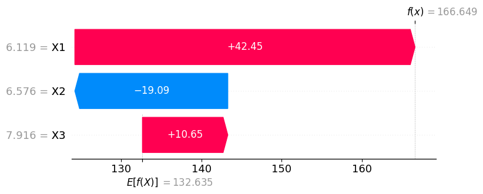
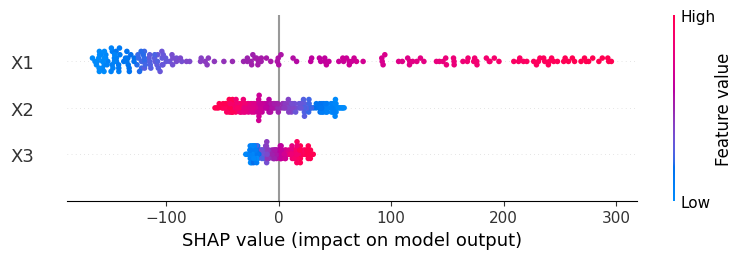

# **Shapley values**

---

### Introduction

Shapley values were originally proposed in the 50s as a way of distributing a total prize among a series of players participating in a game. If you imagine **the prize is the model output $y$**, and **the players are the individual features $x_i$**, you can re-use the same theory to better understand ML models!

Picture this. Your model produced an output $f(x)$, and you want to understand why. Shapley values decompose your prediction into parts

$$f(x) = \phi_0 + \sum_{i} \phi_i$$

where each $\phi_i$ summarizes the contribution of feature $x_i$ to the output! and $\phi_0$ is a baseline constant value.

That's kind of cool, right? **Even if your model isn't linear**, Shapley gives you the **isolated contributions of each feature** to the predicted value. 

!!! example 
    
    You have a model to predict someone's expected yearly salary and want to explain why for person $X$, the output was $ 89'000. Shapley could then give you a decomposition such as

    | Feature | Shapley value |
    |---------|--------------|
    | $\phi_0$ | 45'000 |
    | age = 42 | +33'000 |
    | education = MSc | +4'000 |
    | eyes = brown | -1'000 |
    | fav cheese = gouda | -3'000 |
    | children = 3 | +11'000 |
    | **Total** 💰 | 89'000 |

    where $\phi_0$ is the average salary predicted by the model.

At this point we should ask ourselves:

- How does this method work? 
- What properties does it have?
- What are its limitations?
- Are these contributions linked to causal effects?

Let's answer them one by one.

---

## How does the method work?

The method is grounded in game theory 🎲 and statistics 📊.

It regards $X$ and $f(X)$ as random variables, and computes the baseline $\phi_0$ as the expected value 

$$\phi_0 = E[f(X)]$$

whereas each individual feature contribution $\phi_i$ is given by 

$$\phi_i​=\sum_{S⊆N∖{i}} \frac{​\vert S\vert! \, (\vert N \vert− \vert S \vert−1)!}{\vert N \vert!} \, \Big(f(S∪\{i\})−f(S)\Big)$$

The formula above looks intimidating, but it's actually *a simple weighted sum*. For any so called coalition $S$, the first terms weights its importance, and the second term is the difference in function values when the feature $X_i$ is included vs when it's not included.

**So it's a simple delta!** computed and weighted across all possibles combinations of features. 

!!! example 

    You have the following values $X_1 = 10$, $X_2 = 20$, $X_3 = 30$. Here are all coallitions for $i=1$

    | $S$             | $f(S)$         | $S \cup \{i\}$ | $f(S \cup \{i\})$
    |-----------------|--------------|-------|--------|
    | [ $\emptyset$ ] | $f(\,\cdot\,,\,\cdot\,,\,\cdot\,)$     | [$1$]   | $f(10,\,\cdot\,,\,\cdot\,)$ |   
    | [ $2$ ] | $f(\,\cdot\,,20,\,\cdot\,)$     | [$1$,$2$]   | $f(10,20,\,\cdot\,)$ |   
    | [ $3$ ] | $f(\,\cdot\,,\,\cdot\,,30)$     | [$1$,$3$]   | $f(10,\,\cdot\,,30)$ |   
    | [ $2,3$ ] | $f(\,\cdot\,,20,30)$     | [$1$,$2$,$3$]   | $f(10,20,30)$ |   

    So a coallition $S$ can be thought of as the set of players active in the game.

But what does $f(\,\cdot\,,20,\,\cdot\,)$ even mean? How can we make that evaluate to a scalar in a sensible way?

Well, there are multiple ways of doing that and, up to this date, people debate what the best thing to do is. Next, we explore some of the possibilities.

--- 

## The many possible flavors

In this section we will see how to turn partially-evaluated function e.g. $f(10, \,\cdot\,,\,\cdot\,)$ into scalars in a reasonable way.

How about setting the components $x_2, x_3$ to zero? Or, more in general, defining a *baseline* vector $\bar x$ from which to borrow components every time we need them? In a demographic model, this could be your average individual, and in a computer vision model, your average input image. That's known as **the baseline approach**.

Some would argue that this is not realistic. That if we think our features have some intrinsic distribution, we should fill the gaps in $f(\,10,\cdot\,,\,\cdot\,)$ by **sampling from the distribution of the missing values**, and summarize what we've seen by reporting an average.

Which distribution should it be, though?

- The marginal $p(x_2, x_3)$ ?
- The marginals $p(x_2), p(x_3)$?
- The conditional $p(x_2, x_3 | \, x_1 = 10)$?

What if you don't have a distribution for your features, but only know max/min values for them. Should you maybe sample the domain uniformly?

**All these approaches are possible, but the resulting Shapley values should be interpreted accordingly**[^1].

In fact, researchers are still debating the pros and cons, and theoretical guarantees, of each approach[^2].

[^1]: If for example you disregard a part of your domain where $f$ depends heavily on $x_2$, this won't be reflected on your $\phi_2$ value (and other $\phi_i$ as well).

[^2]: Cite papers.

---

## A computational example

In [this notebook](../notebooks/shap_example.ipynb), we have a simple 2-layer Neural Network that was trained to learn a certain dataset.

To try and explain our black-box model, we use [SHAP](https://github.com/shap/shap): first, instantiate a so-called "explainer", passing your model `mlp` and a dataset `X`. Next, you pass you dataset to the explainer again, which will compute the values for the entire dataset. To see what they look like for the $20$th data point, you can use a nice waterfall plot

```python
import shap

explainer = shap.Explainer(mlp.predict, X)
shap_values = explainer(X)
shap.plots.waterfall(shap_values[20])
```

<div style="text-align:center;">
  
</div>

Here we have the features $x_1 = 6.119, x_2 = 6.576, x_3 = 7.916$, linked to Shapley values $\phi_0 = 132.635$, $\phi_1 = 42.45$, $\phi_2 = -19.09$ and $\phi_3 = 10.65$, for a final prediction of $f(x) = 166.649$.

But that's only for a single datapoint. If you wanna know the rest of the story, how the Shapley values look across the entire dataset $X$, you can call the `summary_plot` method

```python
shap.summary_plot(shap_values, X)
```

<div style="text-align:center;">
  
</div>

The plots tell us $x_2$ has a negative effect on the output (note in the second plot how the blue and red colors are "reversed"). Also, $x_1$ seems to have overall the highest impact on the predictions. It turns out these explanations are very aligned with our ground-truth, which was $f(x_1, x_2, x_3) = 5 x_1^2 - 10 x_2 + 5 x_3$[^3]! 😇

[^3]: N.B. the package is trying to explain the **model**, not the ground-truth. If the training was flawed or the data had too much noise, the model would be a bad representation of it, and the Shapley values wouldn't reflect the ground-truth at all.