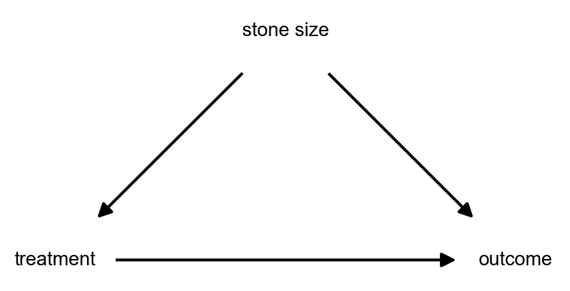

# **Simpson's paradox**

### Introduction

Simpson's paradox highlights how we can reach **totally opposite conclusions** if we aren't careful in our analyses.

!!! example 

    Doctors have developed **two treatments for kidney stones, A and B**. They want to know which of them is the superior one...

    One doctor goes to a hospital and gets the following data:

    | **Treatment** | **Successes** | **Total** | **Success Rate** |
    |----------------|-----------|-------|--------------|
    | A | 81 | 87 | <strong>93%</strong> |
    | B | 234 | 270 | 87% |

    In the meantime, a second doctor goes to another hospital and collects this:

    | **Treatment** | **Successes** | **Total** | **Success Rate** |
    |----------------|-----------|-------|--------------|
    | A | 192 | 263 | <strong>73%</strong> |
    | B | 55 | 80 | 69% |

    Clearly both datasets point to A being the best treatment. 🌟

    Here's the plot twist: when the sit down to write their paper, though, they sum up the numbers a suddently...

    | **Treatment** | **Successes** | **Total** | **Success Rate** |
    |----------------|-----------|-------|--------------|
    | A | 273 | 350 | 78% |
    | B | 289 | 350| <strong>83%</strong> |

    How can the conclusion change simply by aggregating the data??

Imagine how problematic this could be in other contexts too! management is trying to decide if it's better to run ad campaign A or B... or a car manufacturer wants to decide if they should equip new vehicles with safety mechanism A or B... 

Why does this happen and how do we get around it?

### Explanation

There's actually no paradox here: it turns out **Simpson's paradox is just a result of strong confounding** in action. 

Coming back to the kidney stones example, the first hospital could host patients with small stones, and the second hospital patients with large stones. What's more, we see from the tables that there's a preference for treatment B in the first hospital, and for A in the second. So **stone size affects both treatment assignment and (we surmise) the chance of success** - the definition of a confounder.

From the first hospital, we assigned many (270) people to treatment B, and collected also many (234) successes. Note that the lower success rate in that case is 87%, which is much higher than the 69% from the second table. In summary, treatment B is fairly effective and there was enough bias to collect enough success cases for B to result in it winning over A in the combined case.

  

How to deal with it, you ask? Treatment randomization and controlling for confounders are two good starting points... 😉