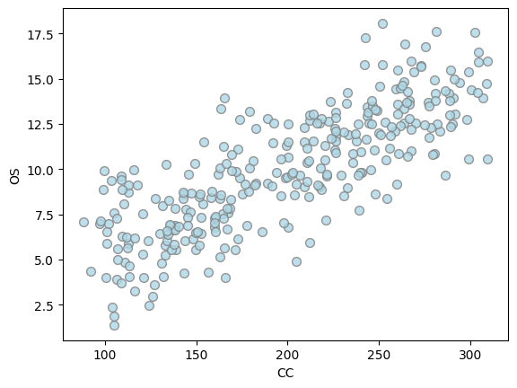

# **When regression goes wrong**

!!! tip "Intro"
    Here's an example of how **even ordinary linear regression with two variables can be dangerous**!

    Being more precise, we will see that no business decisions can be made based on one of the models...

You're a data scientist at an office supply company (maybe Dunder Mifflin 📎) and are given this dataset by your manager

  

Clearly, **both variables are linked** and there's a neat linear trend in the plot. You open a jupyter notebook and fit a linear model using [statsmodels](https://www.statsmodels.org/stable/index.html), being careful to even investigate the p-values of the estimated coefficients. The table you get reassures you: the CC parameter is not only positive, but also has a very low p-value[^1]! The standard error is small and the whole confidence interval is positive.

  

There's just one thing that bothers you... Nobody has told you yet what the variables stand for! 🤔🤔

You go turn some rocks and find out CC stands for *coffee consumption* and OS for *office supply sales*. What's more concerning, your boss is thinking of sending clients complimentary coffee bags in the hopes of boosting your sales. Now that got you worried because if the strategy fails, people will think your analyses are really flawed as you can't even get a linear model right!

  

After some careful thinking, you realize maybe this link between coffee consumption and sales can be explained by the **company size**, which you were missing in your model. Clients with a larger headcount also buy more from you, but **offering them free coffee won't really affect their purchasing patterns**...

After putting together this new column and fitting a new model, voilà, you arrive at

  

showing that coffee consumption has essentially no effect on sales (the confidence interval goes between $-0.026$ and $0.019$ and the p-value is very high, $0.775$). On the other hand, company size explains all the sales variation (positive coefficient of $0.5022$ and p-value of $<0.001$).

You manage to convince your boss to drop the coffee distribution, the day is saved. 🌟

!!! tip "Final remarks"
    The first model (*coffee consumption* to *sales*) was statistically sound, no problem with that. What you can't do is draw causal conclusions from its coefficients, or changing $X$ in the hopes of steering the $Y$ variable. Adding *company size* as a variable made the coefficients match our intuition, our knowledge of how the world works, and that was useful.

    Some questions linger:

    - Is the second model "causal"?
    - Should we look for more variables?
    - Should we always add all variables we have to the model?
    - Under which assumptions can I rest assured my model is interpretable?

[^1]: This indicates that the association you've found was not due to mere chance.

