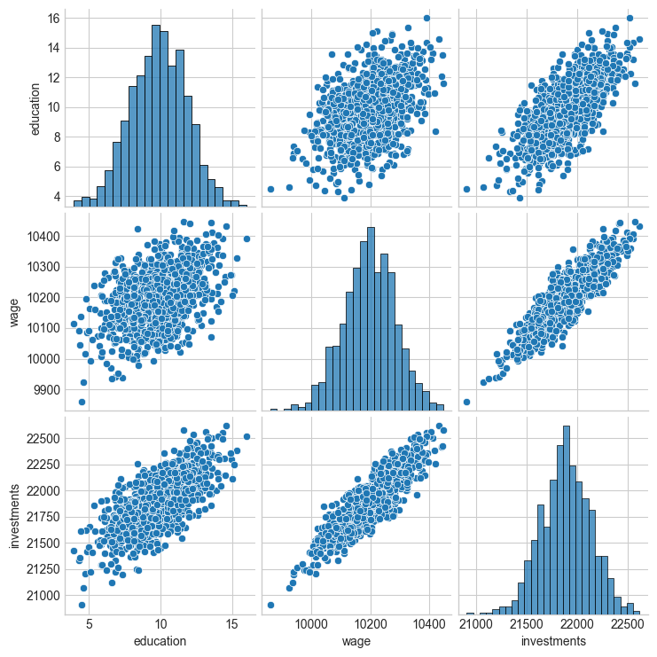
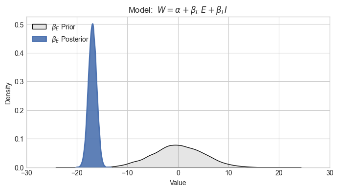
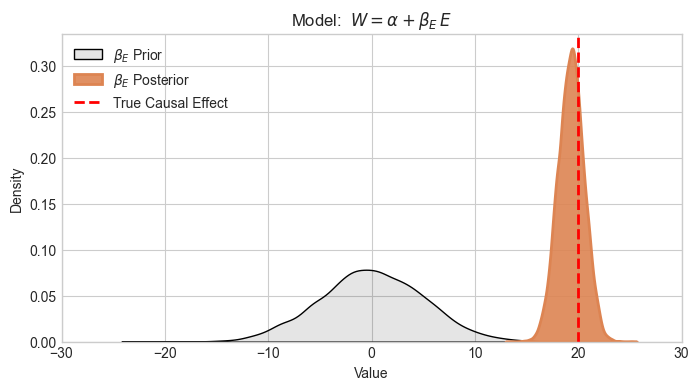

# **When regression goes wrong 2**

!!! note "Intro"
    After going through the [coffee and paper sales](when_regression_goes_wrong.md) pickle, you've learned your lesson: never miss an important variable! Maybe we could take this to the extreme and simply adhere to

    

    *Models should have access to as many variables as possible, and ML will figure out their true relationship!*
    

    Well... Not so fast!

You are asked to study some new dataset, composed of the following variables:

- **Education $E$**: how many years in total different people studies
  
- **Wage $W$:** how much they make per year
  
- **Investment $I$:** how much they have invested in any type of financial instrument

And people want to know: *if you study more, will get a better salary in the future?* Here's what the data tells you:

  

All variables seem to be well behaved, and you can see clear positive association between any two of them. ✅

Let's fit a model to see if we can measure the strength of these relationships. And, just to be on the safe side, you do it using **Bayesian statistics**, to see the true level of uncertainty around your estimates.

You define the following model

$$
\begin{aligned}
W &= \alpha + \beta_E \, E  + \beta_I \, I 
\end{aligned}
$$

and the priors $\alpha \sim N(0,5)$, $\beta_E \sim N(0,5)$ and $\beta_I \sim N(0,5)$, which can lead to both negative or positive final values for those coefficients. After all, we are open to both conclusions.

You take your data and run MCMC to see how the data is gonna transform your prior distribution. To your surprise, you get the following plot:

  

This is really upsetting because even though the pairplot above hinted at the relationship being positive (the more educated, the higher the wage), you see your fancy Bayesian machine pointing at a clearly negative coefficient! 😭

Let's then just drop that extra variable $I$ and see what happens. Sure enough, as soon as you do that, voilà, a much better plot presents itself to you. Since I created the data generating process, I also plotted the true causal effect for you to see. The causal effect was $-20$ all along and the simpler model captured it correctly.

  

